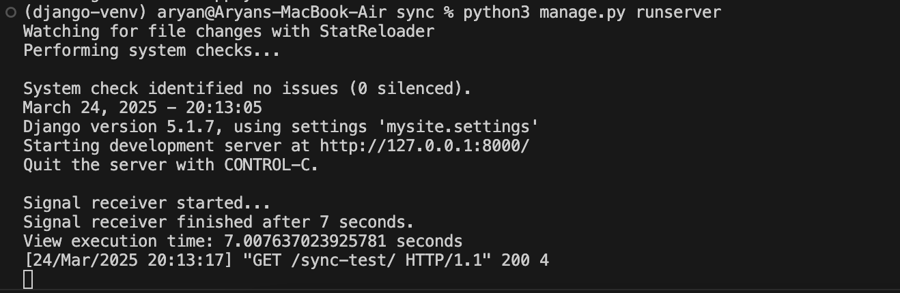
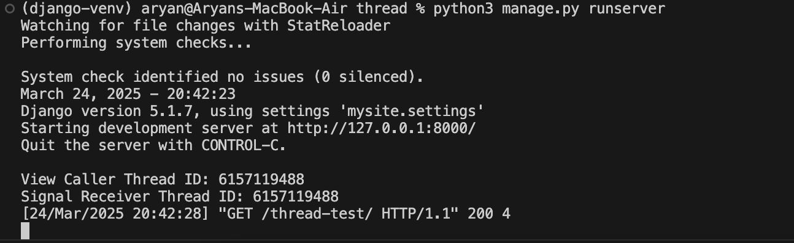
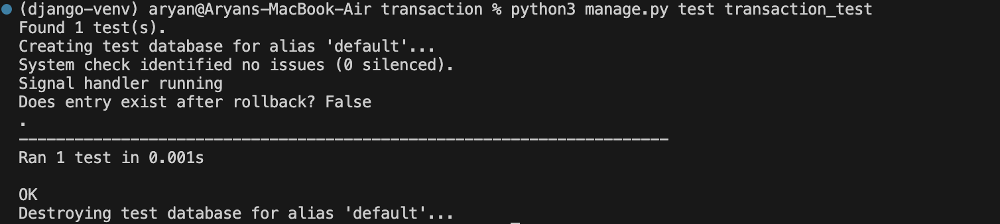

# Django/Python Trainee Assignment

## Topic: Django Signals

### Question 1: By default are django signals executed synchronously or asynchronously? Please support your answer with a code snippet that conclusively proves your stance. The code does not need to be elegant and production ready, we just need to understand your logic.

Answer: By default, django signals are executed **synchronously**.\
Full Code: [signals/sync](signals/sync/)
```
@receiver(post_save, sender=TestModel)
def my_handler(sender, instance, **kwargs):
    print("Signal receiver started...")
    time.sleep(7) 
    print("Signal receiver finished after 7 seconds.")
```


### Question 2: Do django signals run in the same thread as the caller? Please support your answer with a code snippet that conclusively proves your stance. The code does not need to be elegant and production ready, we just need to understand your logic.

Answer: Yes, by default, django signals run in the same thread as the caller.\
Full Code: [signals/thread](signals/thread/)
```
# views.py
def test_view(request):
    print(f"View Caller Thread ID: {threading.get_ident()}")
    TestModel.objects.create(name="Test")
    return HttpResponse("Done")

# signals.py
@receiver(post_save, sender=TestModel)
def signal_receiver(sender, instance, **kwargs):
    print(f"Signal Receiver Thread ID: {threading.get_ident()}")
```


### Question 3: By default do django signals run in the same database transaction as the caller? Please support your answer with a code snippet that conclusively proves your stance. The code does not need to be elegant and production ready, we just need to understand your logic.

Answer: Yes, by default, django signals run in the same database transaction as the caller.\
Full Code: [signals/transaction](signals/transaction/)
```
# signals.py
@receiver(post_save, sender=TestModel)
def my_signal_handler(sender, instance, **kwargs):
    print("Signal handler running")
    sender.objects.filter(pk=instance.pk).update(processed=True)

# test.py
class TransactionSignalTest(TestCase):
    def test_signal_runs_in_transaction(self):
        try:
            with transaction.atomic():
                TestModel.objects.create(name="test_entry")
                raise Exception("Force rollback!")
        except:
            pass
        
        exists = TestModel.objects.filter(name="test_entry").exists()
        print("Does entry exist after rollback?", exists)
```


## Topic: Custom Classes in Python

Description: You are tasked with creating a Rectangle class with the following requirements:

1. An instance of the `Rectangle` class requires `length:int` and `width:int` to be initialized.
2. We can iterate over an instance of the `Rectangle` class 
3. When an instance of the `Rectangle` class is iterated over, we first get its length in the format: `{'length': <VALUE_OF_LENGTH>}` followed by the width `{width: <VALUE_OF_WIDTH>}`

```
class Rectangle:
    def __init__(self, length: int, width: int):
        self.length = length
        self.width = width

    def __iter__(self):
        yield {'length': self.length}
        yield {'width': self.width}
```